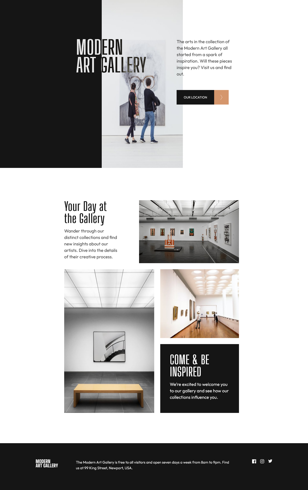
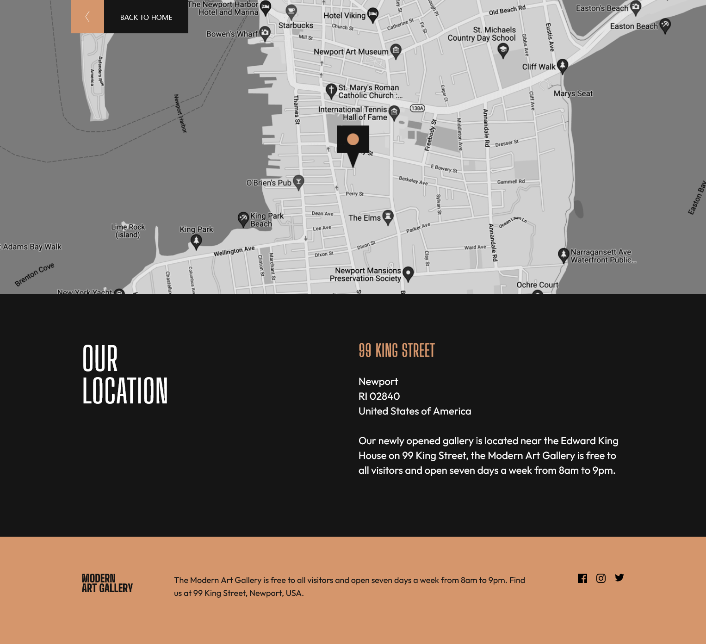
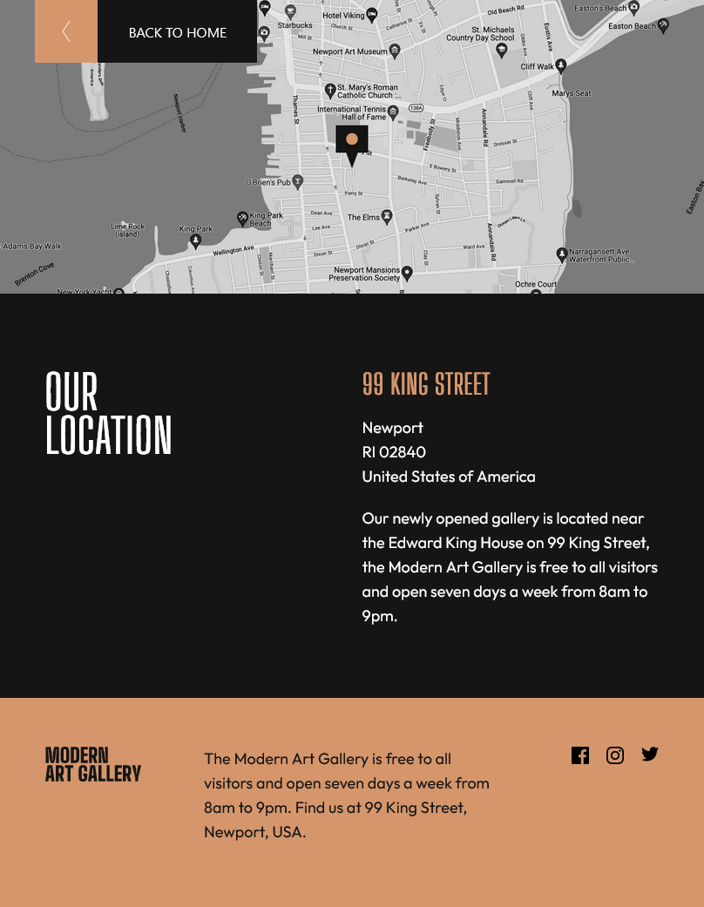
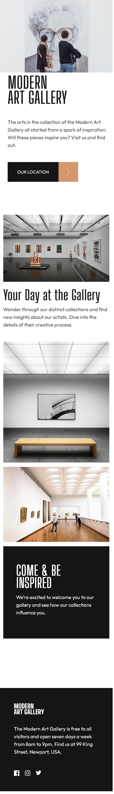

# Objective

Creating a website using TypeScript. Purely a CSS and HTML website.

[Live Link](https://art-gallery-beige-nine.vercel.app/)

# Technologies

## Run
`yarn start`

`npm start`

## Packages
- TypeScript
- SASS
- react-router-dom
- bootstrap
- react-bootstrap

# Development Process
1) Determine if any components can be reusable.
2) Build one row/section of a page.
3) Style from desktop to tablet to mobile.
4) Move onto the next section of page or next page.

# Screenshots

# Credit
Project provide by [Frontend Mentor](https://www.frontendmentor.io/challenges/art-gallery-website-yVdrZlxyA)